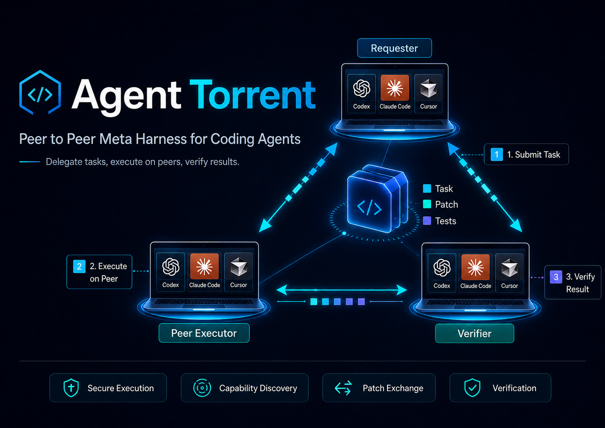

[](https://github.com/raghavan/agent-torrent/actions/workflows/ci.yml)
[](LICENSE)
[](https://www.python.org/downloads/)
[](CONTRIBUTING.md)

A peer-to-peer **meta-harness**: desktop peers advertise agent capabilities
(the `claude` and `codex` CLIs, or a [local LLM](#local-llm-no-cloud-account-needed))
and delegate coding tasks to each other, inspired by BitTorrent-style swarms.
Your subscription idles most of the day — AgentTorrent lets peers seed that
idle capacity to each other and earn credits to spend at their own peak.
Python 3.11+, standard library plus
[PyNaCl](https://pynacl.readthedocs.io/) for signatures.

> **Status: research prototype.** The protocol, sandbox, ledger, and discovery
> all work — every PR is [acceptance-tested](#acceptance-test) end-to-end in
> CI: one peer delegates a task to another that executes it on a **real
> local LLM** (llama.cpp + Qwen2.5-0.5B on the runner's CPU, zero API
> credentials — no cloud provider involved). But there is no authorization layer,
> no result verification, and no transport encryption — by design, to keep
> the interesting questions visible. Read [SECURITY.md](SECURITY.md) before
> running it outside a trusted network.

## Architecture invariants

1. **No server role.** A peer functions identically as requester and
   worker — one codebase, one process (`peer.py`).
2. **No central coordinator.** Discovery is UDP broadcast on the local
   network (beacon every 5 s, peers expire after 30 s), plus an optional
   `bootstrap_peers` list in config for peers across the internet. Peers
   also reply to first-seen beacons with a unicast beacon, so a NAT'd peer
   that bootstraps to a public peer learns about it in return
   (`discovery.py`).
3. **Every message is a signed JSON envelope.** An Ed25519 keypair is
   generated per peer on first run; a peer id is the SHA-1 hash of the
   public key, like a torrent node id. Signatures are verified before
   any message is processed (`identity.py`, `protocol.py`).
4. **Workers never execute outside their sandbox.** The execution
   subprocess gets a fresh temp workdir, a hard timeout from the job
   manifest, and a from-scratch environment — enforced in code, never
   trusted from task text (`executor.py`). The only exception is an
   explicit, operator-controlled env allowlist (see
   [Real execution](#real-execution-vs-simulation)).
5. **Swarm state is rebuildable from gossip.** The peer table is a pure
   cache of received beacons; losing local state and restarting is safe
   (`discovery.py`).

## Layout

| module | role |
|---|---|
| `identity.py` | Ed25519 keypair, peer ids, signed envelope seal/open |
| `manifest.py` | capability manifest (harness detection with version strings) |
| `discovery.py` | UDP broadcast beacons + gossip-built peer table |
| `protocol.py` | TCP JSON-line protocol: `HANDSHAKE`, `TASK_OFFER`, `TASK_ACCEPT`, `TASK_REJECT`, `TASK_RESULT` |
| `job.py` | job manifest schema — all fields required, no defaults |
| `executor.py` | sandboxed harness invocation, simulated when no harness is available |
| `api_harness.py` | the `api` harness: one direct Anthropic Messages API call, run inside the sandbox |
| `ledger.py` | plain-JSON double-entry credit ledger (both peers start at 10) |
| `peer.py` | the peer process: worker + requester + local control channel |
| `cli.py` | `mesh start`, `mesh peers`, `mesh delegate`, `mesh ledger` |

## Quick start

```sh
git clone https://github.com/raghavan/agent-torrent && cd agent-torrent
pip install -e .

mesh start                                       # run a peer (foreground)
mesh peers                                       # gossip-built peer table
mesh delegate "write a python function that reverses a string without slicing" --harness any
mesh ledger                                      # credit balance + records
```

`mesh peers` / `mesh delegate` / `mesh ledger` talk to the running peer
over the same signed TCP protocol (a `CONTROL` message honoured only
from the peer's own key on loopback).

Delegation costs the requester one credit (escrowed at offer time,
released to the worker on a good result, refunded on reject/failure/
timeout); the worker earns one. A peer with a zero balance refuses to
send a `TASK_OFFER`.

## Message flow for one successful delegation

```
Peer A (requester)                          Peer B (worker)
   |   <- both broadcast signed UDP beacons every 5s ->   |
   |--- TCP connect ---------------------------->|
   |--- HANDSHAKE ------------------------------>|  verify sig + id
   |<-- HANDSHAKE -------------------------------|  A verifies likewise
   |  A escrows 1 credit                         |
   |--- TASK_OFFER {job manifest} -------------->|  validate job, check harness
   |<-- TASK_ACCEPT {job_id} --------------------|
   |                                             |  execute in fresh sandbox,
   |                                             |  empty env, hard timeout
   |<-- TASK_RESULT {job_id, output} ------------|  B credits itself 1
   |  A settles escrow to B, prints result       |
```

If no `TASK_RESULT` arrives before the job's timeout (or the connection
drops, e.g. the worker died), A refunds its escrowed credit and reports
the failure gracefully.

## Deploying beyond one machine

**Same LAN** — nothing to configure; broadcast discovery finds peers
automatically.

**Across the internet (e.g. two VPSs)** — broadcast doesn't cross networks,
so point peers at each other's UDP discovery port:

```sh
# on host A                                # on host B
mesh start --tcp-port 9400 \              mesh start --tcp-port 9400 \
  --bootstrap-peer <B_IP>:47474             --bootstrap-peer <A_IP>:47474
```

Open UDP 47474 and the TCP port in both firewalls. A peer behind NAT can
bootstrap to a publicly reachable peer without any port forwarding: its
outbound beacons create the NAT mapping, and the public peer's unicast
beacon reply comes back through it. Delegation then works in the
NAT→public direction (the NAT'd peer can offer tasks to the public one).

**Easiest secure setup** — put all machines on a VPN
([Tailscale](https://tailscale.com)/WireGuard) and use `--bootstrap-peer`
with the VPN IPs. You get encryption and an authorization boundary for
free, which the prototype deliberately does not provide. **Do not expose
an accepting peer to the open internet** — any keypair is a valid peer,
so reachable ports mean strangers can run jobs on your harness.

## Real execution vs simulation

Three harnesses are supported: the `claude` and `codex` CLIs (detected on
PATH), and `api` — a direct LLM API call (stdlib `urllib`, no SDK)
advertised whenever the worker's environment has an `ANTHROPIC_API_KEY`.
The `api` harness runs as a subprocess inside the same sandbox as the
CLIs and speaks two wire formats: the Anthropic Messages API (default)
and, with `AGENTTORRENT_API_FLAVOR=openai`, OpenAI-style chat
completions — which is what local LLM servers speak. Override the model
with `AGENTTORRENT_API_MODEL` and the endpoint with `ANTHROPIC_BASE_URL`.

### Local LLM (no cloud account needed)

Any OpenAI-compatible local server works as a worker backend — llama.cpp,
Ollama, vLLM, LM Studio. The lightest setup is llama.cpp with a ~400 MB
model that runs fine on CPU:

```sh
# terminal 1: serve a tiny model locally (llama-server fetches it once)
llama-server -hf Qwen/Qwen2.5-0.5B-Instruct-GGUF:q4_k_m --port 8080

# terminal 2: a worker peer backed by the local model
ANTHROPIC_API_KEY=local ANTHROPIC_BASE_URL=http://127.0.0.1:8080 \
AGENTTORRENT_API_FLAVOR=openai \
mesh start --env-passthrough ANTHROPIC_API_KEY \
           --env-passthrough ANTHROPIC_BASE_URL \
           --env-passthrough AGENTTORRENT_API_FLAVOR
```

(`ANTHROPIC_API_KEY` can be any placeholder — local servers don't check
it, but the worker uses its presence to advertise the `api` harness.)
With Ollama instead: `ollama serve` + `ollama pull qwen2.5:0.5b`, then
`ANTHROPIC_BASE_URL=http://127.0.0.1:11434` and
`AGENTTORRENT_API_MODEL=qwen2.5:0.5b`.

If a worker has no harness at all (or runs with `--force-simulate`), it
returns a canned simulated response — the full protocol, ledger, and
sandbox path work with zero credentials.

For real execution, the sandbox's from-scratch environment means the
harness has no credentials by default. Allowlist exactly what it needs,
on the worker only:

```sh
ANTHROPIC_API_KEY=sk-... mesh start --env-passthrough ANTHROPIC_API_KEY
```

The allowlist lives in the worker's own config and is never influenced by
the job — task text cannot widen the sandbox. Note that a worker executes
tasks on its own account: understand your provider's terms of service
before seeding capacity to others.

## Acceptance test

```sh
python3 acceptance_test.py
```

Starts two peers on one machine (different TCP ports, shared broadcast
discovery port), delegates the reverse-a-string task from A to B, checks
the result and the one-credit ledger transfer (A: 10→9, B: 10→11), then
kills B mid-job and confirms A fails gracefully and is refunded.

If `ANTHROPIC_API_KEY` is set, peer B executes the task **for real**
through the `api` harness — the test asserts the result is genuine LLM
output (not the canned simulation) and actually contains a function
definition. Without a key it falls back to simulated execution. Set
`AGENTTORRENT_ACCEPTANCE_SIMULATE=1` to force simulation even when a key
is present. Note the real path spends a small amount of API credit per
run and executes on your account.

CI runs the acceptance test on every PR **against a local model only** —
peer B executes the task on llama.cpp serving Qwen2.5-0.5B-Instruct on
the runner's CPU, across Python 3.11 and 3.12. No Anthropic (or any
cloud) API is ever called in CI; the `ANTHROPIC_API_KEY` the job sets is
a placeholder that makes the worker advertise the `api` harness.

To run the real path against a **local model** instead (zero cost, no
account), start a llama.cpp server as shown in
[Local LLM](#local-llm-no-cloud-account-needed) and run:

```sh
ANTHROPIC_API_KEY=local ANTHROPIC_BASE_URL=http://127.0.0.1:8080 \
AGENTTORRENT_API_FLAVOR=openai python3 acceptance_test.py
```

## Contributing

Issues and PRs are welcome — see [CONTRIBUTING.md](CONTRIBUTING.md). The
short version: the five invariants above are law, the acceptance test
must pass, dependencies stay at stdlib + PyNaCl, and every message a peer
sends or receives gets logged. Security reports go through
[SECURITY.md](SECURITY.md), not public issues.

Deliberate non-goals: no token, no DHT, no TLS, no GUI.

## License

[MIT](LICENSE)
